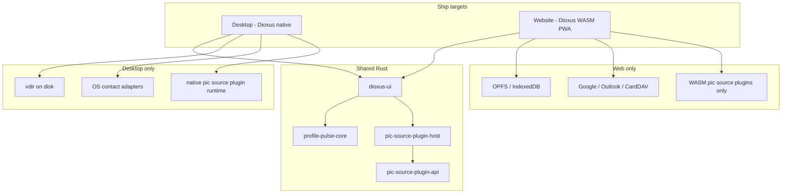

# Design: Profile Pulse Rewrite — Desktop + Web Architecture

Date: 2026-08-22  
Status: Draft (brainstorming)  
Source: [profile-pulse-app.md](../../human-plans/profile-pulse-app.md), [brainstorming-notes.md](../../human-plans/brainstorming-notes.md)

## Problem

Profile Pulse is being rewritten from scratch. The product syncs profile pictures from social and web platforms into a user-owned contact book, with import/export and multi-target sync. The rewrite needs:

- A UI framework and deployment model that scales to multiple surfaces
- Dynamic loading of **profile pic source plugins** so few fetchers ship built-in while users can add more
- A local-first data model with vdir semantics, backups, and conflict handling
- Clear boundaries between core app logic, sync adapters, and third-party **pic source** plugins

Earlier brainstorming assumed **desktop + mobile** with web later. **Mobile is dropped.** v1 targets are **desktop (native)** and **website (browser PWA)** only.

## Goals

1. **One codebase** for UI and domain logic on desktop and web (Dioxus 0.7)
2. **Few built-in profile pic source plugins** (Gravatar, GitHub, GitLab); community adds the rest
3. **User pic source plugins load without rebuilding the app** where platform policy allows
4. **App-owned contact store** with OS / Google / Apple / Outlook / CardDAV as sync adapters
5. **vdir live storage** (one `.vcf` per contact) with aggregated VCF for backup/export
6. **Privacy-first**: contact data stays local; cloud sync is explicit and adapter-mediated

## Non-goals (v1)

- Native mobile apps (iOS / Android)
- User-installable sync plugins (OAuth and contact writes stay first-party; not pic source plugins)
- Profile pic source plugin marketplace or code signing (defer to v2)
- Generic or multi-purpose plugin types (v1 plugins are **profile pic sources only**)
- Server-side backend required to use the web app (static PWA for v1)
- Treating legacy OpenSpec (Iced + SQLite-centric plan) as authoritative

## Platform decision

| Surface     | Technology           | Role                                                                                                   |
| ----------- | -------------------- | ------------------------------------------------------------------------------------------------------ |
| **Desktop** | Dioxus native + Rust | Primary power-user surface: filesystem vdir, OS contacts, native pic source plugins, scheduled backups |
| **Website** | Dioxus WASM PWA      | No-install access; cloud sync only (no OS address book); WASM pic source plugins only                  |

Both surfaces share the same Dioxus UI and Rust core, compiled to native and `wasm32` respectively.



## High-level architecture

### Layered responsibilities

| Layer                                                               | Responsibility                                                                                                  |
| ------------------------------------------------------------------- | --------------------------------------------------------------------------------------------------------------- |
| **UI** (`profile-pulse-app`)                                        | Dioxus views: contact search, details/editor/pic-selector tabs, settings, **profile pic source plugin** manager |
| **Core** (`profile-pulse-core`)                                     | Domain model, profiles, backup rules, conflict resolution, orchestration — no UI, no pic source plugin loading  |
| **Storage** (`profile-pulse-storage`)                               | Pluggable backends: filesystem vdir (desktop), OPFS/IDB (web)                                                   |
| **Sync** (`profile-pulse-sync`)                                     | First-party adapters: Google, Outlook, CardDAV, iCloud (where feasible); OS contacts **desktop only**           |
| **Pic source plugin API** (`profile-pulse-pic-source-plugin-api`)   | Stable host ↔ **profile pic source plugin** contract, versioned                                                 |
| **Pic source plugin host** (`profile-pulse-pic-source-plugin-host`) | Registry, discovery, enable/disable, capabilities, runtimes                                                     |
| **Built-in pic source plugins** (`pic-source-plugins/builtin-*`)    | Gravatar, GitHub, GitLab — compile-time, embedded in both binaries                                              |

The UI and core talk to the **pic source plugin host registry**, not to individual plugin implementations.

### Naming conventions (profile pic source plugins)

In docs, UI copy, and code, **“plugin” always means profile pic source plugin** unless another kind is explicitly named (e.g. sync adapter).

| Kind                      | Convention                                 | Example                                |
| ------------------------- | ------------------------------------------ | -------------------------------------- |
| User-facing label         | Profile pic source plugin                  | Settings → “Profile pic sources”       |
| Short code name           | `pic_source_plugin`, `PicSourcePlugin`     | trait and module names                 |
| Crate: API                | `profile-pulse-pic-source-plugin-api`      | stable contract                        |
| Crate: host               | `profile-pulse-pic-source-plugin-host`     | loader + registry                      |
| Built-in crate dir        | `pic-source-plugins/builtin-<platform>/`   | `pic-source-plugins/builtin-gravatar/` |
| Package extension         | `.pp-pic-source-plugin`                    | zip bundle installed by user           |
| Manifest `kind`           | `"profile-pic-source"` (required)          | rejects wrong plugin types             |
| Plugin id                 | reverse-DNS + `-pic-source` suffix         | `community.whatsapp-pic-source`        |
| User install dir          | `pic-source-plugins/`                      | under app data / OPFS                  |
| WASM artifact             | `pic_source_plugin.wasm`                   | inside package                         |
| Native artifact (desktop) | `pic_source_plugin.so` / `.dylib` / `.dll` | v1.1+ only                             |

Do **not** use generic names like `plugin-api`, `plugins/`, or `.pp-plugin` in new code or docs — they are ambiguous now that sync stays first-party.

### Crate layout (proposed)

```text
crates/
  core/                 # domain, profiles, backup/conflict logic
  storage/              # StorageBackend trait; fs + opfs implementations
  sync/                 # cloud + OS (cfg-gated) adapters
  pic-source-plugin-api/   # ProfilePicSourcePlugin trait + host callbacks
  pic-source-plugin-host/  # registry, lifecycle, runtimes
  app/                     # Dioxus shell; features = ["desktop", "web"]
pic-source-plugins/
  builtin-gravatar/
  builtin-github/
  builtin-gitlab/
```

Platform-specific code uses `cfg(target_arch = "wasm32")` and feature flags (`desktop`, `web`) rather than duplicating UI.

## Data model and storage

### Logical model (both surfaces)

- **Profile**: named local contact book with per-profile settings and optional cache subdirectory
- **Contact**: vCard semantics; **multiple website URLs** with labels
- **Live format**: vdir — one `.vcf` file per contact under `profiles/<name>/contacts/`
- **Backup/export**: aggregated single `.vcf` plus profile metadata export
- **Pre-write backup**: always snapshot before mutating contacts
- **Shared avatar cache**: OK across profiles (dedupe by content hash)

### Physical storage

| Concern          | Desktop                                     | Website                                              |
| ---------------- | ------------------------------------------- | ---------------------------------------------------- |
| Contact vdir     | `~/.local/share/profile-pulse/profiles/...` | OPFS directory tree (same layout)                    |
| Search index     | SQLite on disk                              | WASM SQLite or IDB-backed index                      |
| Avatar cache     | filesystem `cache/avatars/`                 | OPFS `cache/avatars/`                                |
| Secrets          | OS keychain                                 | Encrypted IDB vault (v1: passphrase; later WebAuthn) |
| Scheduled backup | user-chosen folder                          | export download + optional OPFS snapshot             |

Implement a **`StorageBackend`** trait in core; vdir-on-disk and OPFS are interchangeable backends. UI and sync code depend on traits, not paths.

## Sync architecture

### Semantics (locked)

- **Default**: push-only outbound sync
- **Pull**: explicit user action
- **Background**: remote-change check on linked targets → prompt user to pull
- **Conflicts on pull**: per-contact — Keep local / Take remote / Review

### Adapter matrix

| Adapter             | Desktop | Website | Notes                                    |
| ------------------- | ------- | ------- | ---------------------------------------- |
| Google Contacts     | Yes     | Yes     | OAuth + API                              |
| Outlook / Microsoft | Yes     | Yes     | OAuth + API                              |
| CardDAV             | Yes     | Yes     | OAuth or app password                    |
| Apple / iCloud      | Yes     | Limited | Platform-dependent; document constraints |
| OS address book     | Yes     | **No**  | Windows / macOS / Linux native APIs      |

**Sync adapters are first-party only** — not profile pic source plugins. They handle OAuth, rate limits, and contact writes. **Profile pic source plugins** only discover and fetch candidate profile pictures.

### Profile creation flow

When a user creates a profile, they may link **multiple outbound targets** (Google, Apple, Outlook, CardDAV, OS on desktop). The app-owned store remains source of truth; adapters are projections.

## Profile pic source plugin architecture

Plugins in Profile Pulse are **profile pic source plugins** only: they take contact context (emails, website URLs) and return candidate profile pictures. They do not sync contacts, edit vCards directly, or replace sync adapters.

Future plugin kinds (if any) would use separate traits, package kinds, and install paths — not overloaded “plugin” APIs.

### Design pattern: pic source plugin host with multiple runtimes

One logical **`ProfilePicSourcePlugin`** contract; three load mechanisms:

| Runtime            | Desktop | Website | Use case                                                        |
| ------------------ | ------- | ------- | --------------------------------------------------------------- |
| **BuiltinRuntime** | Yes     | Yes     | First-party pic source plugins compiled into the app            |
| **WasmRuntime**    | Yes     | Yes     | **Primary** format for user/community pic source plugins        |
| **NativeRuntime**  | Yes     | No      | Desktop escape hatch for pic source plugins — **defer to v1.1** |

Rust has no stable ABI between compiler versions. User native pic source plugins require a **C ABI** and documented toolchain pins. WASM provides one artifact format for desktop and web with sandboxing.

### Pic source plugin contract (conceptual)

```rust
// Stable logical API — exposed via Rust (builtin), WASM exports, or C ABI (native)

trait ProfilePicSourcePlugin {
    fn metadata(&self) -> PicSourcePluginMetadata; // id, name, version, min_host_version
    fn capabilities(&self) -> PicSourceCapabilities; // network, read_secrets, etc.

    /// Given contact context, return candidate profile pic sources
    fn discover_sources(&self, ctx: &ContactContext) -> Vec<ProfilePicCandidate>;

    fn fetch_pic(&self, source: &ProfilePicCandidate) -> Result<ProfilePicBytes, PicSourcePluginError>;
}
```

`ContactContext` includes: emails, all website URLs and labels, existing cached pic hash.

### Pic source plugin package: `.pp-pic-source-plugin`

Zip archive with fixed layout:

```text
whatsapp-pic-source.pp-pic-source-plugin/
  manifest.toml              # required; kind = "profile-pic-source"
  pic_source_plugin.wasm     # required for web; sufficient for desktop user plugins
  pic_source_plugin.so       # optional desktop-only native payload (v1.1+)
  icon.png                   # optional
  LICENSE                    # required for third-party plugins
```

**manifest.toml** example:

```toml
kind = "profile-pic-source"         # required — host rejects other kinds
id = "community.whatsapp-pic-source"
name = "WhatsApp profile pic source"
version = "0.1.0"
min_host_version = "1.0.0"
runtime = "wasm"                    # wasm | native
capabilities = ["network"]
website_match = ["whatsapp.com"]    # powers pic-selector convenience UI
```

### Discovery and install paths

| Source         | Desktop                                            | Website                                                  |
| -------------- | -------------------------------------------------- | -------------------------------------------------------- |
| Built-in       | embedded at compile time                           | same                                                     |
| User directory | `~/.local/share/profile-pulse/pic-source-plugins/` | origin storage / OPFS `pic-source-plugins/`              |
| Install UI     | “Install profile pic source…”                      | upload `.pp-pic-source-plugin` or install from HTTPS URL |

Host merges pic source plugins by `id`. User plugin overriding a built-in requires explicit user consent in settings.

### Host services (pic source plugins never touch vdir or raw OS)

Pic source plugins call **host functions** only:

| Host API                    | Purpose                                  |
| --------------------------- | ---------------------------------------- |
| `http_get(url, headers)`    | Rate-limited HTTP; web host handles CORS |
| `get_secret` / `set_secret` | Per-plugin credentials from secure store |
| `cache_get` / `cache_put`   | Shared avatar cache                      |
| `log(level, msg)`           | Structured logging                       |
| `emit_progress`             | Pic-selector progress UI                 |

### Pic-selector UX flow

1. User opens **Profile pic selector** tab for a contact.
2. Pic source plugin host runs `discover_sources()` on all **enabled** profile pic source plugins (bounded parallelism).
3. UI lists candidates with pic source name and preview.
4. User selects → core writes `PHOTO` to contact vdir + updates search index.
5. Convenience actions (“Add GitHub link”) update contact via **core**, not pic source plugin; `website_match` in manifest drives shortcuts.

### Built-in vs user pic source plugins

| Tier                       | Examples                                    | v1                                |
| -------------------------- | ------------------------------------------- | --------------------------------- |
| **Built-in (always on)**   | Gravatar, GitHub, GitLab                    | Ship in app                       |
| **Built-in (toggle)**      | LinkedIn, Twitter (API/scrape)              | Optional, off by default if risky |
| **User WASM pic source**   | WhatsApp-inspired fetchers, Discord, Twitch | Primary community path            |
| **User native pic source** | Platform-specific bridges                   | v1.1 desktop only                 |

### Security model

- **Capability declarations** in manifest; user approves on install.
- **No sync/export pic source plugins** — v1 pic source plugins fetch profile pictures only.
- **Sandbox**: WASM default; native desktop pic source plugins get reduced host API (never full disk).
- **GPL**: third-party `.pp-pic-source-plugin` is a separate work; document boundary in user-facing install flow.
- **Signing**: optional v1; required for curated pic source directory in v2.

### Web-specific pic source plugin constraints

- Only **WASM** runtime; no `dlopen`.
- Scraping-heavy pic source plugins (Facebook, Instagram) may hit **CORS** — document as “public API pic sources on web”; scraping pic sources may be desktop-oriented or require host proxy (future).
- Installed pic source plugins persist in origin storage; respect storage quotas.

## v1 implementation scope

### Ship in v1

1. Core + storage (`StorageBackend`: desktop vdir + web OPFS)
2. Dioxus UI on desktop and web PWA
3. Built-in profile pic source plugins: Gravatar, GitHub, GitLab
4. WASM pic source plugin host on **both** surfaces + sample community pic source plugin
5. Cloud sync: Google + one of Outlook or CardDAV
6. Desktop-only: OS contact adapter for one OS first (pick based on author platform)
7. Profile pic source plugin manager UI (list, enable/disable, install file, capability approval)

### Defer

- Native desktop pic source plugin runtime (v1.1 unless WhatsApp is hard v1)
- Profile pic source plugin marketplace and code signing
- Full social scrape pic source plugins on web
- Apple/iCloud sync if blocked by platform APIs on web
- Server-side backend for web

## Open questions

| Topic                  | Options                                                    |
| ---------------------- | ---------------------------------------------------------- |
| Auth for cloud targets | OAuth PKCE (web + desktop); app passwords for CardDAV      |
| Remote-check UX        | Poll interval; per-target vs any-target prompt             |
| SQLite role            | Index/search/pic metadata only vs richer query layer       |
| Web secret storage     | Passphrase-encrypted IDB v1 vs WebAuthn wrap later         |
| CORS / scraping on web | Public-API-only pic source plugins vs desktop proxy helper |

## Locked decisions summary

| Topic                              | Choice                                                                         |
| ---------------------------------- | ------------------------------------------------------------------------------ |
| UI framework                       | Dioxus 0.7                                                                     |
| v1 platforms                       | **Desktop + website (PWA)** — mobile dropped                                   |
| Live contact book                  | App-owned store; adapters are projections                                      |
| Profile                            | Named book; multi-target outbound sync on create                               |
| Sync semantics                     | Push default; explicit pull; background remote-change prompt                   |
| Pull conflicts                     | Per-contact: Keep local / Take remote / Review                                 |
| On-disk format                     | vdir live + aggregated VCF for backups                                         |
| Profile pic sources                | **Profile pic source plugin** host; few built-in; user WASM pic source plugins |
| User pic source plugin format (v1) | **WASM `.pp-pic-source-plugin` only** on both surfaces                         |
| Native user pic source plugins     | Desktop only; **defer to v1.1**                                                |
| Sync adapters                      | First-party only, not profile pic source plugins                               |
| Web deployment                     | Static PWA, local-first, no required backend                                   |

## References

- Human plan: [profile-pulse-app.md](../../human-plans/profile-pulse-app.md)
- WhatsApp logic reference: <https://github.com/guyzyl/whatsapp-contact-sync>
- Brainstorming log: [brainstorming-notes.md](../../human-plans/brainstorming-notes.md)
